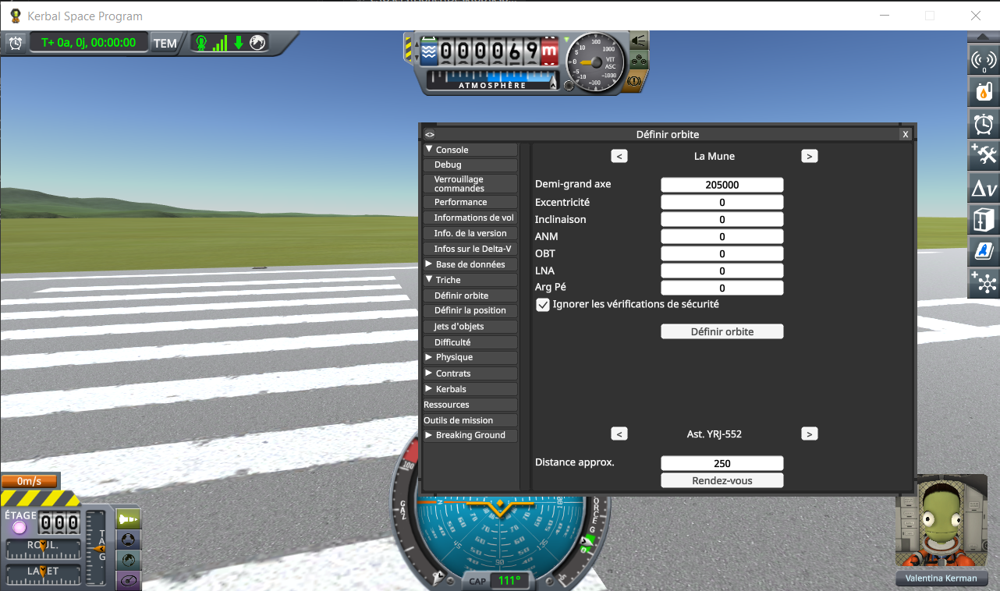
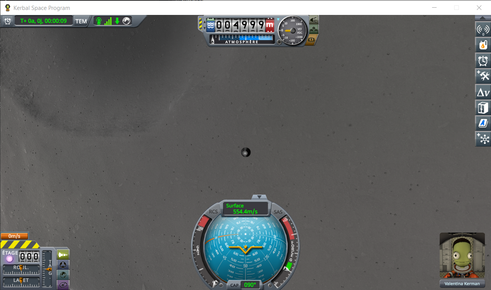

# PQS Bench

Measures what building the KSP terrain costs, in flight: how many quads the game builds per second, how
long each one takes, and how much of a frame that is. It corrects nothing and changes nothing about the
game — it only counts.

It was written to check what
[Terrain Precision Fix](https://github.com/lhervier/KSP-TerrainPrecisionFix) costs, but it knows nothing
about that mod, or any other. Everything it measures is stock `PQS`, and `calibrate` times whatever is
patching the vertex placement without needing to know what that is.

## Install

Requires KSP 1.12 and [HarmonyKSP](https://github.com/KSPModdingLibs/HarmonyKSP) (the usual
`GameData/000_Harmony`, also installed by KSP Community Fixes).

Copy `GameData/PQSBenchMod` into the `GameData` of KSP. Nothing is written to your saves.

**With `benchMode = off`, which is how it ships, no Harmony patch is applied at all**: the mod is inert,
and leaving it installed costs nothing.

## Settings

`GameData/PQSBenchMod/PluginData/settings.cfg`, read once when KSP starts. To change it: quit KSP, edit
the file, start KSP again.

| `benchMode` | what is recorded |
|---|---|
| `off` (default) | nothing, and nothing is patched |
| `counters` | what the terrain costs in flight, one line per second of game time |
| `calibrate` | adds what one terrain vertex costs, installed against stock — see below |

`logLevel` takes `Error`, `Warning`, `Info` (default), `Debug` or `Trace`. **Measure at `Info`**: the
measurement itself writes at `Info`, and anything above it makes other mods write to `KSP.log` on the
very path being timed.

In flight:

- **Alt+F8** writes everything recorded so far to `KSP.log`.
- **Alt+F7** throws it away and starts again.

Nothing is written until you ask for it: writing while measuring would cost more than what is being
measured. The recording is static — loading another save does not reset it, Alt+F7 does.

## What comes out

One line per second of game time, semicolon separated, for a spreadsheet or a script. Time warp is
skipped entirely: the craft crosses the ground far too fast for a sample to mean anything.

| column | |
|---|---|
| `ut`, `utSpan` | when the sample was taken, and how much game time it covers |
| `realSeconds`, `frames`, `fps` | and how much real time that was |
| `altitude`, `speed` | where the craft was at the end of it |
| `quads`, `vertices` | terrain quads actually built during that second |
| `topLevelQuads` | of which quads of the highest subdivision level — the ones the game detaches into `LocalSpacePQStorage`, which carry the collider craft stand on |
| `buildMs`, `topLevelBuildMs` | what `PQS.BuildQuad` spent on them |
| `updateMs` | what the whole terrain update of the sphere cost that second: the quad builds, plus the subdivision decisions and the normals. This is what a frame pays |
| `subdivisionAvg`, `subdivisionMax` | the levels those quads were at |
| `speedLevelCap`, `maxLevel` | the ceiling the game put on subdivision, and the sphere's own maximum |

Plus, once per terrain sphere, a `BENCH sphere` line with what decides how far it subdivides, and a
`BENCH colliders` line per `PQSMod_QuadMeshColliders` with its `maxLevelOffset`. Read on Kerbin and the
Mun, KSP 1.12.5:

| sphere | minLevel | maxLevel | highest level appears under | lowest level with a collider | max angle per sample |
|---|---|---|---|---|---|
| Kerbin | 2 | 10 | 9 375 m | 10 | 4.60e-5 rad |
| Mun | 2 | 9 | 6 250 m | 9 | 9.20e-5 rad |
| KerbinOcean | 2 | 7 | 75 000 m | none | 3.68e-4 rad |

**`speedLevelCap` is the column to watch.** `PQ.UpdateSubdivision` only splits a quad while
`subdivision < sphereRoot.maxLevelAtCurrentTgtSpeed`, and that ceiling is worked out from how far the
craft moves between two samples of real time: the faster it flies — or the slower the game runs — the
lower it falls. A run where `speedLevelCap` sits below `maxLevel` never built the quads you were trying
to measure.

## `calibrate`: what is installed, against stock, on the same data

`counters` measures the game as it runs. `calibrate` answers a narrower question: what does **one
terrain vertex** cost, and how much of that does the mod under test change?

A vertex costs around a hundred nanoseconds, and a `Stopwatch` tick is a hundred nanoseconds, so the
placement has to be replayed. On one quad in thirty-two, in the frame that just built it, each of three
things is run over the quad's vertices, eight rounds each, and the quad is then put back exactly as it
was found. The order rotates from quad to quad, so each runs as often first as last.

| | |
|---|---|
| `installed` | `PQS.BuildVertexSurfaceRelative` itself, so it runs through whatever Harmony patch is on it — or straight to stock when there is none. **The bench does not know, and does not need to know, which mod that is** |
| `stock` | a copy of the stock placement, four lines long. It stays measurable in a run where the stock method is patched, and it is the yardstick two runs are compared through |
| `harness` | places nothing. What it measures is what the replay itself costs — the fields written before each call, and the indirect call — which the two others also pay, and which is subtracted from both |

The dump gives `stockNsPerVertex` and `installedNsPerVertex` **net of the harness**, their difference,
and the three raw figures so that the subtraction can be checked.

### Two things the replay has to reproduce

**Where a placement reads its inputs.** `PQS.BuildVertexSurfaceRelative` ignores the `VertexBuildData`
it is handed and reads `vbData`, `vertexIndex` and `buildQuad`, three fields of `PQS`. The replay sets
them for every vertex, identically for every formula — which is the cost `harness` is there to measure.

**A quad it has not seen.** A placement that works something out once per quad, and reuses it for that
quad's couple of hundred vertices, only pays for it once. Replay eight rounds without saying so and
seven of them ride free, which flatters the cache by a factor of eight. So before each timed round, and
outside the clock, the bench re-enters `PQS.BuildQuad` on the quad: stock turns an already built quad
away on the method's first line, before touching anything — but the Harmony prefixes have run by then.

That is the one thing a mod has to do to be measured honestly here:

> **A mod that keeps state per terrain quad must invalidate it on a `PQS.BuildQuad` prefix.**

It is not a rule invented for this: a quad can be rebuilt after having been moved, so anything worked
out from it is stale at that point anyway.

### What the dump says about the run

The `BENCH begin` line names the Harmony ids patching `PQS.BuildVertexSurfaceRelative` and
`PQS.BuildQuad`, so a log says for itself which run it is.

`differingQuads` counts the calibrated quads where the installed placement put a vertex somewhere other
than stock does, compared exactly. Zero means either that nothing is patching the placement, or that
what is changes what it costs without changing the terrain.

## Measuring a terrain mod

The flight is on rails, so loading the same save twice covers the same ground twice. A run with the mod
being measured installed, against a run with its folder taken out of `GameData`, is the whole method —
and taking it out is the only honest reference: a mod left in place with its correction switched off
still pays for its own patches on the path being timed.

One run measures one configuration, since a Harmony patch is installed for the whole session. What makes
the runs comparable is that each of them carries its own `stock` yardstick, measured in the same frames
as the thing under test: read `installedNsPerVertex` against the `stockNsPerVertex` of **its own run**,
not against another machine's.

### The craft

1. A new craft carrying **a command pod and nothing else**. Any craft works; one part keeps it obvious.
2. Launch it. From the VAB or the SPH, it makes no difference.
3. Debug menu (Alt+F12) → *Cheats* → *Set Orbit*. Pick the Mun, then set **Semi-Major Axis to 205000**
   and leave every other field at 0. The semi-major axis is measured from the **centre of the body**,
   not from the ground: 5 km up is the Mun's 200 km radius plus 5 000, so 205 000. Zero eccentricity and
   zero inclination give a circular equatorial orbit, which keeps the craft at that one altitude and
   away from the higher ground off the equator. Tick the box that skips the safety checks, then
   *Set Orbit*.

   

4. Save. The craft is now 5 000 m up, crossing the ground at 554 m/s:

   

The screenshots are from a French install; the fields are in the order above whatever the language.

5 km over the Mun is a compromise: below the 6 250 m the highest level needs, high enough not to hit a
ridge, and low enough that about 40 % of the quads built are top level ones. On another body, read
`highestLevelUnder` in the log first and aim well below it.

### The runs

Each run is a fresh KSP — `settings.cfg` is only read at startup, and so is `GameData`. **Copy `KSP.log`
between two runs**, KSP overwrites it at every start.

Load the save, **Alt+F7** once in flight so that the scene load is not in the samples, fly a couple of
minutes at ×1, then **Alt+F8**. Use the same two marks in every run: the numbers are rates and ratios,
but two runs are only comparable if they cover the same stretch of orbit.

A run is worth keeping when `topLevelQuads` is above zero and `speedLevelCap` sits at `maxLevel`. The
`BENCH begin` line records which Harmony ids were patching the terrain, so a log says for itself which
run it is.

## Build

Set `KSPDIR` to your KSP install folder, which must contain `GameData/000_Harmony`, and run `build.bat`.
It needs the .NET SDK, and produces `GameData/PQSBenchMod/PQSBenchMod.dll`.

## How this was made

Written with Claude, Anthropic's AI assistant. I am saying so because it is true, and because it is a
measuring instrument: every figure it produces is only worth what the code that produced it is worth, so
read it before you trust it.

## Licence

MIT, see [LICENSE](LICENSE).
