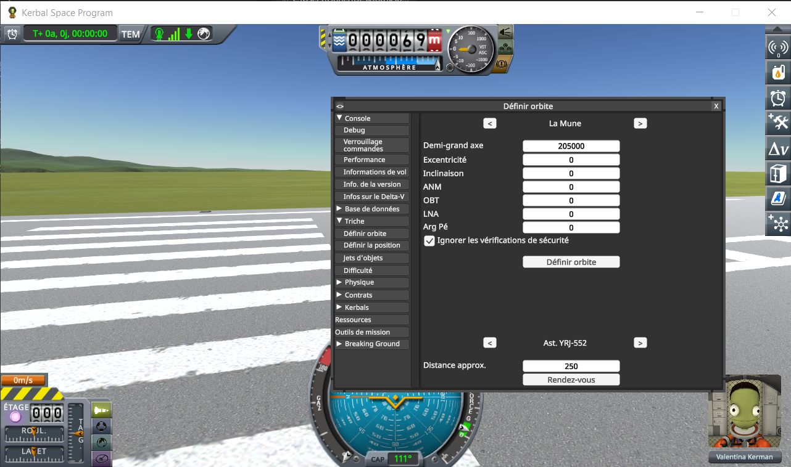
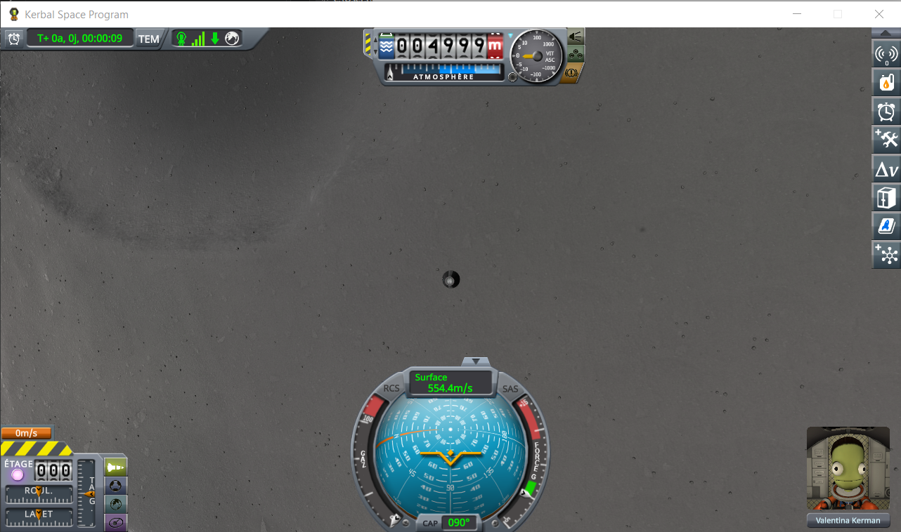
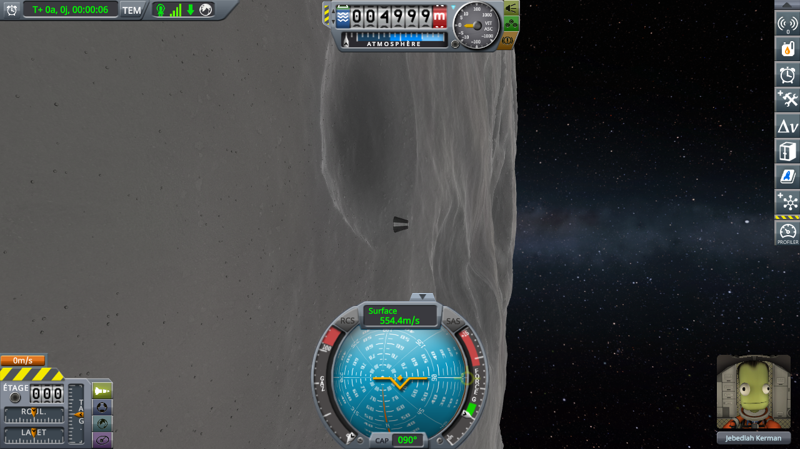

# Measuring a terrain mod

Part of [PQS Bench](../README.md). The short version is on the main page, under
[Measuring a terrain mod](../README.md#measuring-a-terrain-mod); here is the whole protocol: the game and
the machine, the save, and the runs, played by hand or by a script.

The flight is on rails, so loading the same save twice covers the same ground twice. A run with the mod
being measured installed, against a run with its folder taken out of `GameData`, is the whole method —
and taking it out is the only honest reference: a mod left in place with its correction switched off
still pays for its own patches on the path being timed.

One run measures one configuration, since `GameData` is read once at startup. The bench only replays
the vertex placement: for a mod that does not patch `PQS.BuildVertexSurfaceRelative`, it has nothing to
tell, and a frame profiler is the measurement.

**The bench does real work inside the frames it runs in**: never time frames — with a profiler or
anything else — in a run where it is installed. Take its folder out of `GameData` for those.

## The game and the machine

Set once, before the first run, and left alone until the last one:

- **Vertical sync off** (in KSP's `settings.cfg`: `SYNC_VBL = 0`), and no frame limit
  (`FRAMERATE_LIMIT`). With either, the frame rate follows the screen or the setting, and the frame rate
  decides how far the terrain subdivides (see
  [How the terrain of that body is set up](how-the-bench-works.md#how-the-terrain-of-that-body-is-set-up)):
  the quads built would depend on the screen rather than on the game.
- **The same terrain detail preset** in every run. It decides how far the sphere subdivides, and the
  `BENCH run` line gives it.
- **The machine in the same state**: on mains power and at maximum performance for a laptop, nothing
  heavy running alongside, and KSP forced onto one graphics device when there are two. The
  `BENCH machine` line gives the processor and the graphics device; write the memory type down with the
  results, the log cannot.

## The save

**The save the reference runs were flown from is provided**:
[`perfs/ref-mune-5km.sfs`](../perfs/ref-mune-5km.sfs), a sandbox game saved in KSP 1.12.5, holding one Mk1
command pod in a circular equatorial orbit 5 km over the Mun. To use it, copy it into the folder of a sandbox
game in `saves`, and load it from that game (Alt+F9). Its craft is called `Vaisseau sans nom`, which is what the `BENCH run` lines will say.

Flying from that save covers the same ground as the runs in [`perfs/`](../perfs/). The steps that made it
follow, for another altitude or another body.

## Making the save yourself

1. A new craft carrying **a command pod and nothing else**. Any craft works; one part keeps it obvious.
2. Launch it. From the VAB or the SPH, it makes no difference.
3. Debug menu (Alt+F12) → *Cheats* → *Set Orbit*. Pick the Mun, then set **Semi-Major Axis to 205000**
   and leave every other field at 0. The semi-major axis is measured from the **centre of the body**,
   not from the ground: 5 km up is the Mun's 200 km radius plus 5 000, so 205 000. Zero eccentricity and
   zero inclination give a circular equatorial orbit, which keeps the craft at that one altitude. Tick
   the box that skips the safety checks, then *Set Orbit*.

   

4. Save. The craft is now 5 000 m up, crossing the ground at 554 m/s:

   

The screenshots are from a French install; the fields are in the order above whatever the language.

**It takes some luck.** The Mun's equator rises above 5 km in places: that orbit does not go all the way
round, and the craft crashes before it does. A save is only usable if the couple of minutes a run flies
from it clear the ground, so it may take a few tries — which is why the provided one is worth using.

5 km over the Mun is a compromise: below the 6 250 m the highest level needs, and low enough that about
40 % of the quads built are top level ones. On another body, read `highestLevelUnder` in the log first
and aim well below it.

## The runs

Each run is a fresh KSP — `settings.cfg` is only read at startup, and so is `GameData`. **Copy `KSP.log`
between two runs**, KSP overwrites it at every start.

1. Load the save.
2. Turn the camera so that part of the ground is in view, the same way in every run, and leave it there.
   Right after the load, the camera does not show the Mun at all. Turn it to look ahead along the orbit:
   in orbit the camera turns in the orbit's frame, so the Mun's edge stands upright on the screen. Stop
   when the Mun's ground fills the left two thirds of the screen, the sky the right third, the capsule
   in the middle against the ground:

   

   The game does not place the camera the same way at every load, and what it shows changes what a frame
   costs to draw: with a different view, the frame rate, and with it how far the terrain subdivides,
   would follow the view. The ground's share shrinks as the run goes on, to about half the screen at
   1 min 40 s: the camera's frame does not turn with the craft. Leave it so.
3. Look at the mission time in flight, and pick a round value a little ahead of it: 30 s, for instance.
4. When it reads that value, **Reset**. The scene load is then out of the recording.
5. A set time later, 2 min 30 s for instance, at ×1 all along, **Dump to KSP.log**.

**These two marks, the same in every run, are what makes the flights reproducible and comparable.** The
craft is on rails: starting and stopping at the same mission time means flying over the same stretch of
ground, and building the same quads. The `utStart` and `utSpan` of the `BENCH run` lines are there to
check it.

A run is worth keeping when the `quads` of its `BENCH calibration` line is above zero. Its `BENCH run`
and `BENCH begin` lines are what says it was the run you meant to fly, with the mods you meant to have
installed.

## The runs, played by a script

The same runs can be played by [`perfs/automation/run-perfs.py`](../perfs/automation/run-perfs.py), which
drives KSP through [KSP-MCPServer](https://github.com/lhervier/KSP-MCPServer), a mod that answers HTTP
requests on 127.0.0.1 and offers tools to drive the game. When it is installed, the two buttons of PQS
Bench and the showing or hiding of its window are among those tools (see
[`Src/McpTools.cs`](../Src/McpTools.cs)); PQS Bench runs the same without it. The script needs Python 3
and nothing else: no package to install, and no AI.

Each run is still a fresh KSP, here with KSP-MCPServer and PQS Bench installed (the script stops if it
also finds KSPProfiler, below), the provided save copied into a sandbox game as above. With KSP at its main
menu, run:

```
python run-perfs.py --folder <your sandbox game> --out out
```

It plays the steps of [The runs](#the-runs), in the same order:

1. It loads the save.
2. It turns the camera to the framing of step 2: heading 204° in the orbit's frame, pitch 0, which looks
   ahead along the orbit with the Mun's ground on the left two thirds of the screen. It hides the window
   of PQS Bench.
3. At 30 s of mission time, **Reset**.
4. At 1 min 40 s, **Dump to KSP.log**. Nothing is asked of the game between the two: the script sleeps
   through, for the game time left converted at the pace the game kept before the *Reset*.

It then writes `run.json` into `--out` — the mission time at both ends, the game and real seconds between
them, the pace — and quits KSP, unless `--keep-running` is given. The figures are in `KSP.log`, as in a
run played by hand: copy it before the next run. The mission time is counted from the launch time of the
save's active craft, read from a copy of the save (`--sfs`, by default the one in `perfs/`). Other
options change the save (`--save`), the two marks (`--start` and `--stop`, in seconds of mission time),
the camera heading (`--heading`) and the port of KSP-MCPServer (`--port`).

**Turn the on-screen messages of KSP-MCPServer off for a run**: `screen_messages = false` in its
`GameData/KSPMCPServer/PluginData/settings.cfg`, read when KSP starts. Left on, as it is by default, each
tool names itself at the top of the screen, and the message of the tool that starts the measure would be
drawn in the frames being measured.

With [KSPProfiler](https://github.com/KSPModdingLibs/KSPProfiler) installed instead of PQS Bench — through
[a fork of it](https://github.com/lhervier/KSP-ExtMod-KSPProfiler) that only adds a remote control of its
window's buttons, nothing in what it measures changed — the script plays the same run with *Start
capture*, *Stop capture* and *Export to CSV*, the profiler's window open: frames are timed on the
Performance page of each mod measured, not here.
